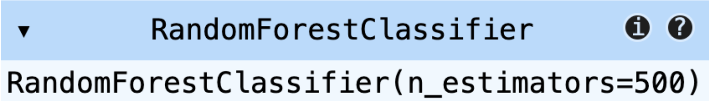
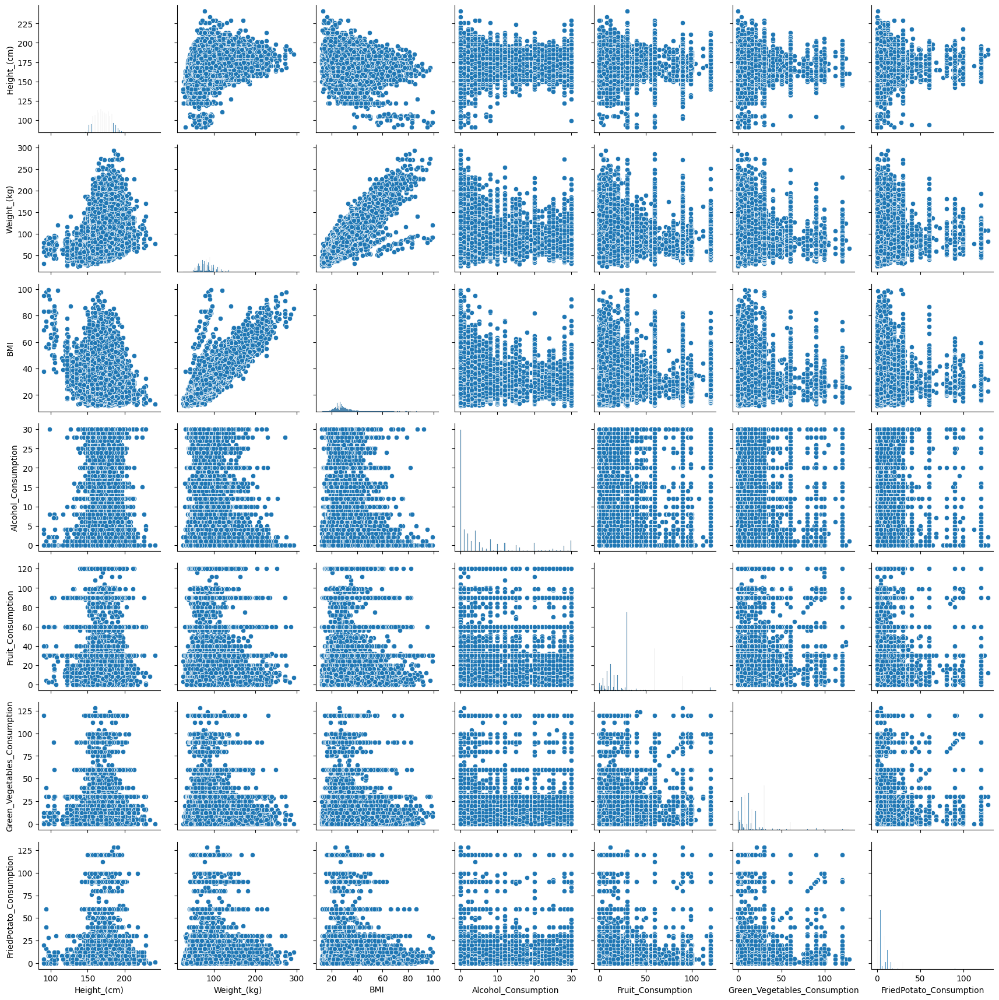
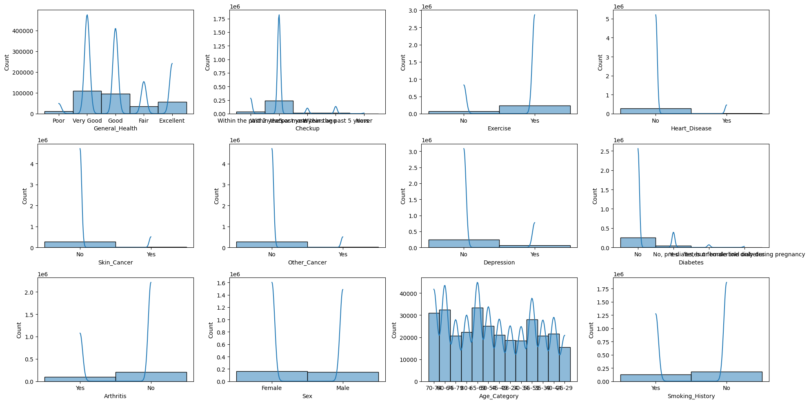
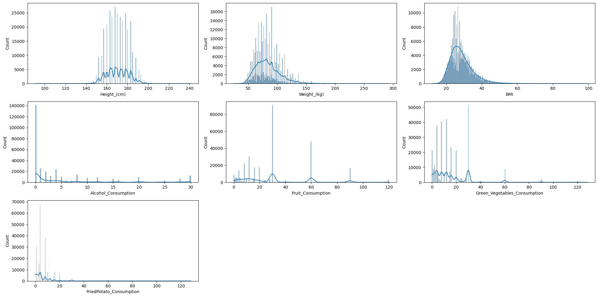
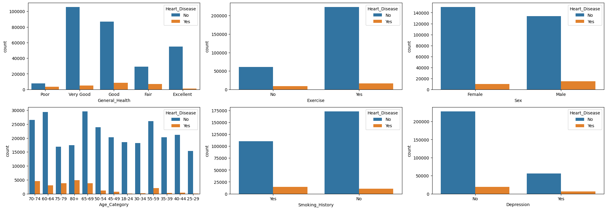
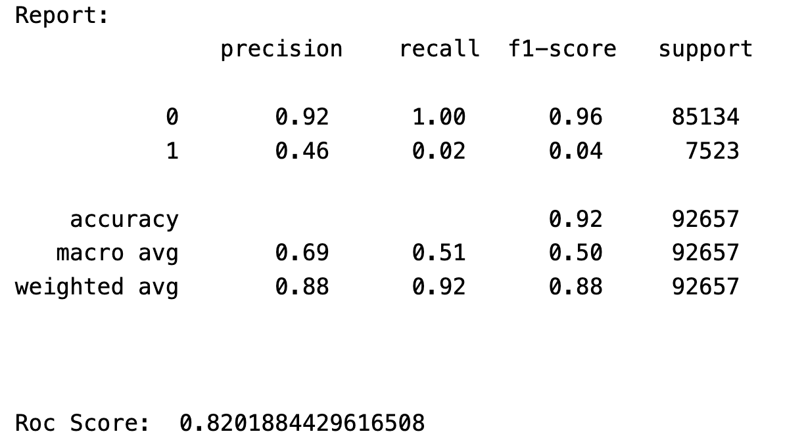

# NSCC Capstone Project: Cardiovascular Disease Risk Prediction Model
This repository was created to fulfill the requirements of NSCC's Capstone Project as part of Team Prediction in the Business Intelligence Analytics Program. The objective of the Capstone Project is to acquire hands-on experience on a group project applying much of the material and skills learned throughout the program.

### Introduction and Motivation

This project aims to develop a robust predictive model for assessing the risk of cardiovascular disease (CVD) using the random forest algorithm. Cardiovascular diseases are among the leading causes of mortality globally. Early risk prediction can significantly improve outcomes through timely intervention and preventative measures. This project combines data exploration, visualization, and machine learning to provide insights into CVD risk factors and predict individual risk levels.

### Features

* Data Exploration and Visualization: Utilizing seaborn and Matplotlib for in-depth analysis and visualization of dataset attributes.
* Data Preprocessing: Employing Scikit-learn for data cleaning and preparation tasks.
* Predictive Modeling: Building and training a random forest classifier to accurately predict CVD risk.

### Technologies Used
- Python
- numpy
- pandas
- Scikit-learn
- Seaborn
- Matplotlib

### Dataset

The dataset used in this project is comprehensive, covering a wide range of variables associated with cardiovascular disease (CVD) risk factors. Each record in the dataset represents individual respondents with the following attributes:

- **General_Health**: Overall health rating of the individual (e.g., Excellent, Very Good, Good, Fair, Poor).
- **Checkup**: Frequency of medical checkups (e.g., Within last year, Within past two years, etc.).
- **Exercise**: Information on physical activity levels. (Yes/No)
- **Heart_Disease**: Presence of heart disease (Yes/No).
- **Skin_Cancer**: History of skin cancer (Yes/No).
- **Other_Cancer**: History of any cancer other than skin cancer (Yes/No).
- **Depression**: Indicator of depression (Yes/No).
- **Diabetes**: Indicates if the individual has diabetes (Yes/No).
- **Arthritis**: Indicates if the individual has arthritis (Yes/No).
- **Sex**: Biological sex of the respondent.
- **Age_Category**: Age range category of the respondent.
- **Height_(cm)**: Height of the individual in centimeters.
- **Weight_(kg)**: Weight of the individual in kilograms.
- **BMI**: Body Mass Index calculated from height and weight.
- **Smoking_History**: Smoking habits (Yes/No).
- **Alcohol_Consumption**: Quantity of alcohol consumption.
- **Fruit_Consumption**: Quantity of fruit consumption habits.
- **Green_Vegetables_Consumption**: Quantity of green vegetable consumption.
- **FriedPotato_Consumption**: Quantity of fried potato consumption.

This dataset provides a holistic view of factors that could influence the risk of developing cardiovascular diseases, allowing for detailed analysis and modeling to predict CVD risk.

### Model Building and Training

The predictive model for cardiovascular disease risk prediction was constructed using the RandomForestClassifier from sklearn, leveraging its capabilities for handling complex datasets with a mix of categorical and numerical data.

#### Model Configuration
- **Algorithm**: RandomForestClassifier
- **Key Parameter**: `n_estimators` was set to specify the number of trees in the forest, chosen based on preliminary validation to balance between overfitting and computational efficiency.

#### Training Process
- **Training Data**: The model was trained using `X_train` for the input features, encompassing a diverse range of variables such as age, gender, blood pressure, and cholesterol levels.
- **Target Variable**: `y_train` represented the presence or absence of cardiovascular disease, serving as the output parameter for the model.
- **Methodology**: Employed a robust training methodology to ensure the model accurately captures the underlying patterns without overfitting the training data.

The RandomForestClassifier was chosen for its efficacy in classification tasks, its intrinsic ability to manage overfitting, and its feature importance capabilities, which are instrumental for understanding the predictive power of the various risk factors involved in cardiovascular disease.

### Model Validation and Testing
- **Prediction**: Applied the trained model to the testing dataset to predict cardiovascular disease risk.
- **Probability Assessment**: Computed prediction probabilities, offering insights into model confidence levels for each prediction.

### Model Evaluation
- **Classification Report**: Generated a detailed classification report using sklearn, providing precision, recall, and f1-score metrics for a comprehensive performance assessment.
- **ROC Score**: Calculated the receiver operating characteristic (ROC) score, measuring the model's ability to distinguish between classes.

## Visualizations
### PairGrid - Histogram and ScatterPlot

### Distribution of the Categorical Features of the Dataset

### Distribution of the Numerical Features of the Dataset

### Visualization of Factors Causing Heart Disease

## Key Findings
- The RandomForestClassifier demonstrated promising accuracy in predicting cardiovascular disease risk, as evidenced by the classification report and ROC score.

## Report Breakdown:

### Class 0 (Negative Class):
- **Precision**: 92% of instances predicted as class 0 are actually class 0.
- **Recall**: The model correctly identifies 100% of all actual class 0 instances.
- **F1-Score**: 96%, indicating a very high balance between precision and recall for class 0.
- **Support**: There are 85,134 actual instances of class 0 in the dataset.

### Class 1 (Positive Class):
- **Precision**: 48% of instances predicted as class 1 are actually class 1.
- **Recall**: Only 2% of the actual class 1 instances were correctly identified by the model.
- **F1-Score**: 5%, indicating a poor balance between precision and recall for class 1.
- **Support**: There are 7,523 actual instances of class 1 in the dataset.

### Accuracy:
- Overall, the model correctly predicted 92% of all cases. However, this metric can be misleading for imbalanced classes.

### Macro Avg:
- **Precision**: Average precision across both classes without considering class imbalance is 70%.
- **Recall**: Average recall across both classes is 51%.
- **F1-Score**: Average F1 score is 50%.

### Weighted Avg:
- Accounts for class imbalance by weighting the average based on the number of instances in each class.
- **Precision**: 88% considering class imbalance.
- **Recall**: Same as accuracy, 92%.
- **F1-Score**: 88%, considering class imbalance.

## Interpretation:

While the model performs exceptionally well in class 0 (likely the majority class), it struggles significantly with class 1, as indicated by the low recall and F1-score for class 1. This suggests the model is biased towards the majority class and has difficulties identifying the minority class (class 1), which is a common issue in imbalanced datasets.

## Impact
- **Predictive Power**: This model significantly enhances my ability to predict cardiovascular disease risk, potentially informing more targeted preventative measures.
- **Model Confidence**: Probability assessments provide valuable insights into the model's confidence in its predictions, guiding clinical decision-making processes.

### Understanding the Results
The notebook includes detailed comments and visualizations to help you understand each step of the process, from data exploration to model evaluation. Here's what to look for:

* Data Exploration and Visualization: Initial sections of the notebook provide insights into the dataset's structure and distribution of variables.
* Model Training: Look for the section where the RandomForestClassifier is trained with the cvd_cleaned.csv dataset.
* Model Evaluation: The final sections will show the model's performance on the test set, including accuracy, precision, recall, and the ROC score. Interpret these metrics to gauge the model's effectiveness in predicting cardiovascular disease risk.

## Contact
For any questions or discussions, feel free to contact me at [steve@stevearmstrong.org](mailto:steve@stevearmstrong.org).

